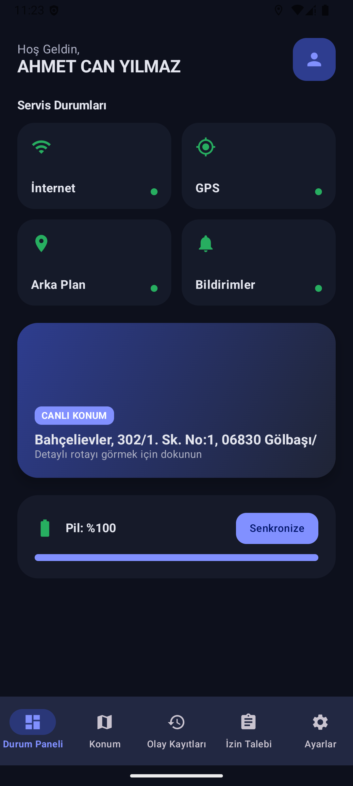
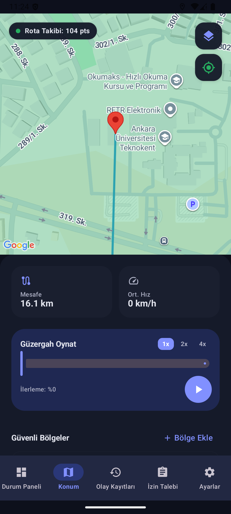
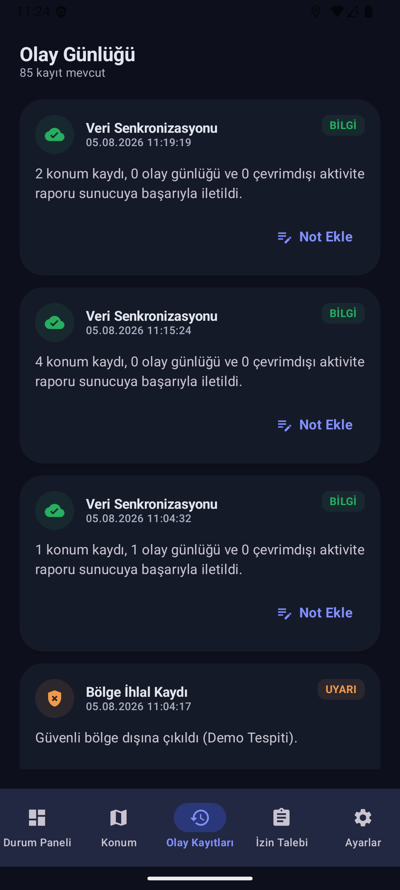
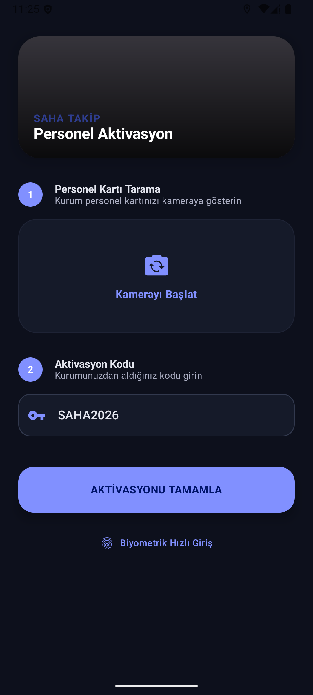
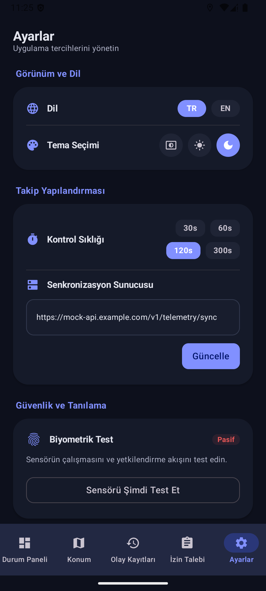
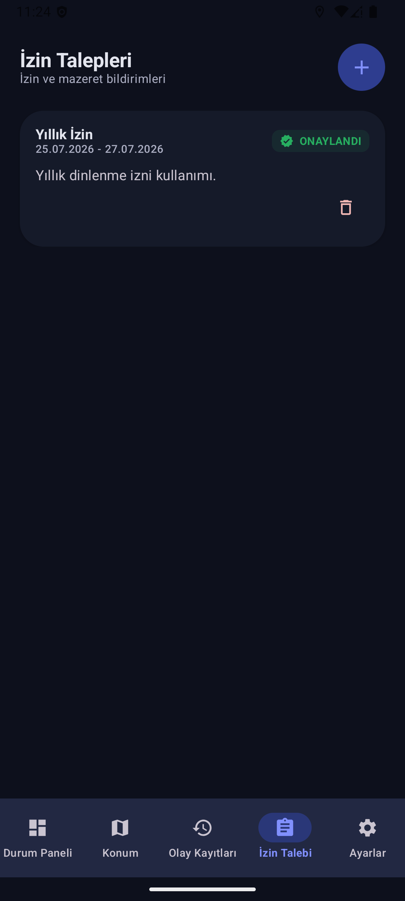

# SahaTakip - Profesyonel Saha Personel Takip Sistemi

SahaTakip; saha teknisyenleri ve personelinin konumlarını, cihaz durumlarını ve görev bölgelerini (Geofence) gerçek zamanlı olarak izleyen, gizlilik odaklı, modern ve kurumsal bir Android uygulamasıdır.

## 🚀 Öne Çıkan Özellikler

### 📍 Takip ve İzleme
- **Kesintisiz Arka Plan Konumu:** Cihaz uykuda veya uygulama kapalıyken bile düşük güç tüketimiyle hassas konum kaydı.
- **Akıllı Rota Oynatma:** Geçmiş konum verilerini harita üzerinde farklı hızlarda (1x, 2x, 4x) görselleştirme.
- **Dinamik Geofencing:** Harita üzerinden güvenli bölgeler tanımlama; bölge ihlali durumunda anlık sistem bildirimi ve olay günlüğü oluşturma (Türkçe karakter desteği ile).
- **Gelişmiş Harita Görselleştirme:** Binaların, yerleşkelerin (kampüs, AVM vb.) ve yapıların detaylı kuşbakışı görünümü; kullanıcı deneyimini artıran optimize edilmiş harita katmanları.

### 🛡️ Güvenlik ve Gizlilik
- **Hibrit Veri Şifreleme:** Yerel Room veritabanının **SQLCipher (AES-256)** ile şifrelenmesi ve hassas ayarların **Android Keystore** destekli **AES/GCM** ile korunması.
- **Biyometrik Giriş:** Parmak izi veya yüz tanıma desteği ile verilerin güvenliğini sağlayan ekran kilidi.
- **Güvenli Anahtar Yönetimi:** API anahtarlarının ve hassas verilerin `Secrets Gradle Plugin` ile korunması; kaynak kodda anahtar sızıntısının önlenmesi.
- **Gelişmiş Cihaz Güvenliği:** Magisk, BusyBox, sistem bütünlüğü (test-keys) ve düşük seviyeli sistem özelliklerini (ro.debuggable, ro.secure) kapsayan kapsamlı root tespiti ve profesyonel Material 3 uyarı sistemi.
- **Gizlilik Bildirimleri:** Arka plan aktiviteleri hakkında kullanıcıyı bilgilendiren şeffaf bildirim sistemi.

### 📊 Telemetri ve Senkronizasyon
- **Dinamik Cihaz Durumu:** Pil yüzdesi, şarj durumu, internet bağlantısı ve GPS aktifliğinin anlık izlenmesi.
- **Çevrimdışı Çalışma (Offline-First):** İnternet bağlantısı koptuğunda verileri Room DB'de saklama; bağlantı sağlandığında otomatik senkronizasyon.
- **Olay Günlüğü (Event Logs):** Cihazın durum değişikliklerini (Düşük pil, GPS kapanması, Bölge ihlali) zaman damgalı olarak kaydetme.

### 📱 Modern Kullanıcı Deneyimi
- **Adaptif Tasarım:** Tabletlerde Navigation Rail, telefonlarda Bottom Navigation kullanan; özellikle küçük ekranlı (Compact) cihazlar için optimize edilmiş (Scaling & Layout adjustment) esnek arayüz.
- **Material 3:** Modern, temiz ve göz yormayan "Dynamic Color" destekli tasarım.
- **Çift Dil Desteği:** Türkçe ve İngilizce dilleri arasında dinamik geçiş.

---

## 📸 Ekran Görüntüleri

Uygulamanın arayüzünü ve temel özelliklerini aşağıda görebilirsiniz:

|    **Ana Panel (Dashboard)**    | **Canlı Harita & Takip** |   **Olay Günlüğü**    |
|:-------------------------------:|:------------------------:|:---------------------:|
|  |       |  |

|      **Biyometrik Giriş**       |    **Ayarlar & Güvenlik**     |   **İzin Talepleri**    |
|:-------------------------------:|:-----------------------------:|:-----------------------:|
|  |  |  |

### 🎥 Uygulama Tanıtım Videosu

SahaTakip uygulamasının gerçek zamanlı performansını ve kullanım senaryolarını izlemek için **GitHub Releases** sayfasındaki tanıtım videosuna göz atabilirsiniz:

[](https://github.com/sariefe/SahaTakip/releases/tag/video)

---

## 🛠 Kullanılan Teknolojiler (Tech Stack)

- **UI:** Jetpack Compose & Material 3
- **Mimari:** Clean Architecture (MVVM) & SOLID Prensipleri
- **Bağımlılık Enjeksiyonu:** Hilt (Dagger)
- **Güvenlik:** Secrets Gradle Plugin
- **Yerel Veritabanı:** Room Persistence Library & **SQLCipher (Encrypted DB)**
- **Veri Depolama:** Jetpack DataStore (Preferences)
- **Şifreleme:** Android Keystore System & AES-GCM
- **Ağ:** Retrofit & OkHttp & Moshi
- **Asenkron Akış:** Kotlin Coroutines & Flow
- **Konum:** Google Play Services Location
- **Test:** JUnit 4, MockK, Robolectric, Roborazzi

## 🏗 Proje Yapısı

```text
com.example
├── di/             # Bağımlılık Enjeksiyonu (Hilt Modülleri)
│   ├── AppModule.kt       # Genel uygulama bağımlılıkları
│   ├── DatabaseModule.kt  # Room DB ve DAO tanımları
│   ├── NetworkModule.kt   # Retrofit ve API servisleri
│   ├── RepositoryModule.kt # Repository binding işlemleri (SOLID - DIP)
│   └── ServiceModule.kt   # Servis ve Utils binding işlemleri
├── data/           # Veri Katmanı (Implementasyonlar)
│   ├── local/      # Room DB, DAO'lar, Preferences
│   ├── remote/     # Mock API tanımları
│   └── repository/ # Repository Implementasyonları (SRP - Veri Erişimi)
├── domain/         # Alan Katmanı (İş Kuralları ve Soyutlamalar)
│   ├── model/      # UI'dan bağımsız veri modelleri
│   ├── repository/ # Repository Arayüzleri (Abstractions)
│   └── service/    # Arka plan servisleri (LocationTrackingService)
├── ui/             # Sunum Katmanı (Jetpack Compose)
│   ├── components/ # Özelleştirilmiş Harita ve UI bileşenleri
│   ├── navigation/ # AppNavGraph ve Ekran rotaları
│   ├── screens/    # Dashboard, Harita, Ayarlar, Olay Günlükleri
│   ├── theme/      # Renk paleti, Tipografi, Material 3 Teması
│   └── viewmodel/  # Durum yönetimi (State Management)
├── util/           # Yardımcı Araçlar (İzinler, Güvenlik, Konum hesaplama)
├── MainActivity.kt # Ana giriş noktası (Hilt Entry Point)
└── SahaApplication.kt # Hilt Android App sınıfı
```

## 📋 Kurulum ve Çalıştırma

1. **Projeyi Klonlayın:**
   ```bash
   git clone https://github.com/efe-sari/staj-testing.git
   ```
2. **API Anahtarı Ayarı:** Projenin kök dizinindeki `local.properties` dosyasına Google Maps API anahtarınızı ekleyin:
   ```properties
   MAPS_API_KEY=YOUR_API_KEY_HERE
   ```
3. **Derleme:** Android Studio (Ladybug 2026.1.3+) ile projeyi açın ve Gradle senkronizasyonunu başlatın.
4. **İzinler:** Uygulama açılışında konum, bildirim ve kamera izinlerini onaylayın.
5. **Arka Plan Takibi:** Kesintisiz izleme için cihazın "Pil Tasarrufu" modunu kapatın ve konum iznini "Her zaman izin ver" olarak ayarlayın.

## 🧪 Testler ve Kalite

Proje, yüksek kod kapsamı (code coverage) hedefiyle geliştirilmiştir:
- **Unit Tests:** ViewModel ve Repository mantığının doğrulanması.
- **Robolectric:** Android framework bileşenlerinin (Intent, Context) simülasyonu.
- **Screenshot Testing:** Arayüz bileşenlerinin farklı çözünürlüklerdeki görsel kontrolü.

Testleri çalıştırmak için:
```bash
./gradlew test
```

## 📜 Lisans

Bu proje, staj ve profesyonel gelişim kapsamında geliştirilmiştir. Tüm hakları saklıdır.
